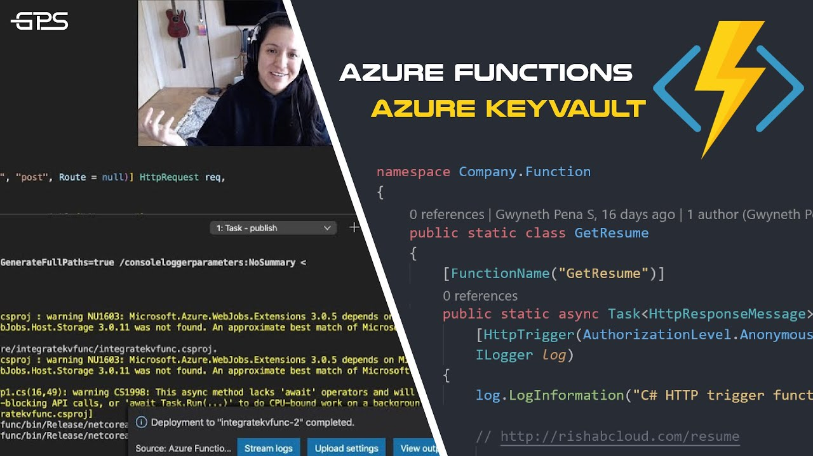
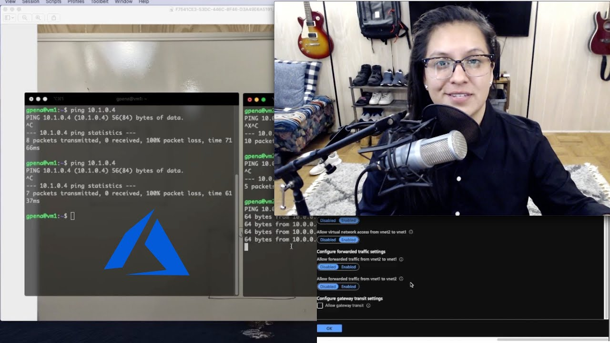

# Day 6: Publish the video

In the [start here guide](../start-here/README.md) I suggested gear and software, and tutorials on them. Brush up on those and make sure everything is set up before you get started with this day.

Also here's a video I made on how I [make videos](https://youtu.be/2nPXhwPpy04) might be helpful here.

- **Time commitment:** You'll need about 1 hour for this.

- **Tools you'll need:** Thumbnail creator, YouTube

## Steps

### 1. Upload the video

Go to your YouTube channel and upload the video, as it uploads you can create your thumbnail.

> **Action step:** Upload the video to YouTube

### 2. Create your thumbnail

If you are using Canva, there are plenty of templates you can use. Pick one of those. I like to grab a screenshot of my face and of my screen to fill in the thumbnail. This is really up to you. Here are some examples of mine.

> **Action step:** Create your thumbnail

### 2. Fill in details of your video

Now it's time for you to fill in the title, description, and more. There's a lot in here, and to be 100% honest, I don't do it all. I just make sure my title is descriptive and honest, my description contains the chapters of the video, resources, and my social links, and I'll add end cards.

Take a look at the description of [this video](https://www.youtube.com/watch?v=p0zgKoxpu24) for an idea of what I do.

If you want to learn way more about things you can set on your video, [check this tutorial out](https://youtu.be/tuH25VRn2k4)

> **Action step:** Fill in details of your video.

### 3. Hit publish

Once your video is done uploading, you've added the thumbnail and filled in details you can now publish!

### 4. Share it

Now take your video URL and share it on any social media that you have. When I was getting started I would share on Reddit, Twitter, Instagram, and dev.to

Just don't be annoying and mass message your contacts to watch it, nobody likes that.

### 5. That's it

Go take a break and move on to the next day whenever you're ready :)
